## Links

Plugin repo: https://github.com/nama-gatsuo/AzureKinectForUE

Updated plugin repo: https://github.com/cormacmadden/Kinect-Body-Tracking-Unreal-Engine-Plugin

## Install Visual Studio

1. Download Visual Studio 2022 community edition from here: https://visualstudio.microsoft.com/downloads/?cid=learn-onpage-download-install-visual-studio-page-cta (this might already be installed as part of installing unreal engine)
2. Run visual studio installer:

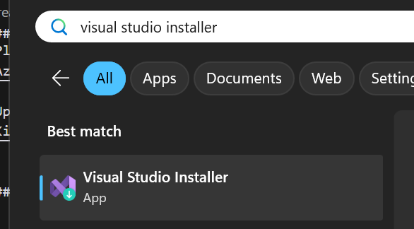

3. Modify Visual Studio Community 2022:

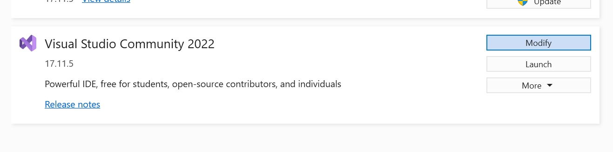

4. Check the following and install:

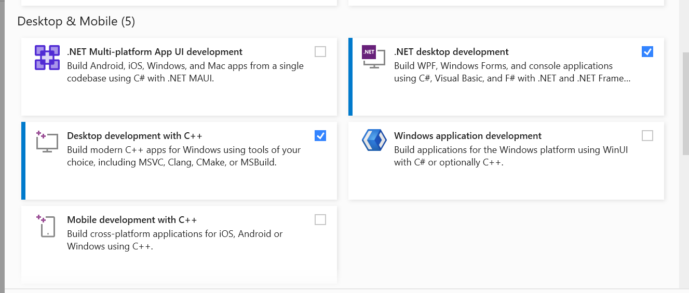

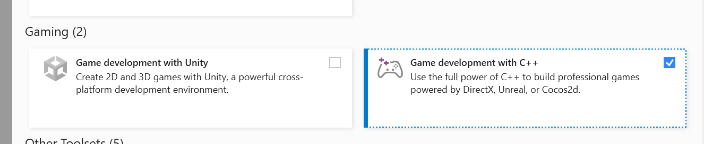

## Setting up project

Error when opening a project with the plugin:

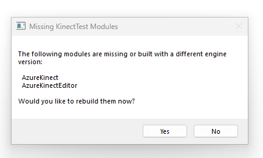

How to fix? https://www.reddit.com/r/unrealengine/comments/1acndak/the_following_modules_are_missing_or_built_with_a/

1. Temporarily rename the `Plugins` folder to something else (`Plugins_` maybe?) so the unreal engine project can load. 
2. Open the project from the .uproject file
3. If there are no Source files, an empty C++ class should be created inside unreal engine. This step is needed for step 5 to work since it needs a `Source` folder at the root of the project to generate a Visual Studio project.

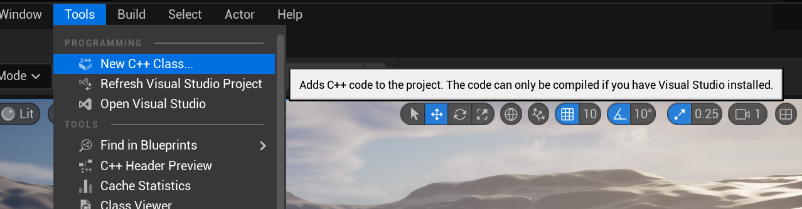

4. Delete the following: .vs, Binaries, Intermediate, Saved and solution files/folders.

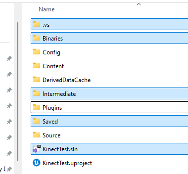

5. Rename the `Plugins_` (or whatever you called it) folder back to `Plugins`.

6. Right click the project file and click "Generate Visual Studio project files"

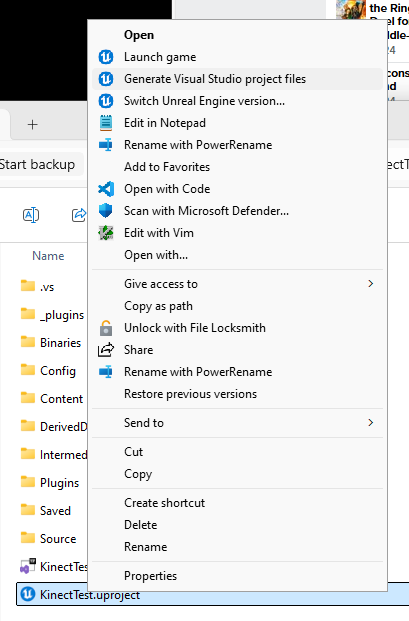

7. A .sln file should now be created in the root of the project. Open this file in Visual Studio (should open Visual Studio automatically).

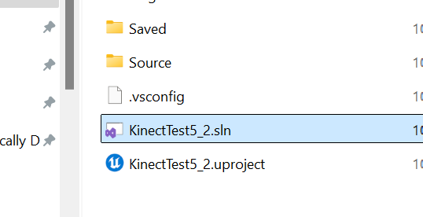

8. Run `Build` by right clicking the project root under `Solution Explorer` in Visual Studio

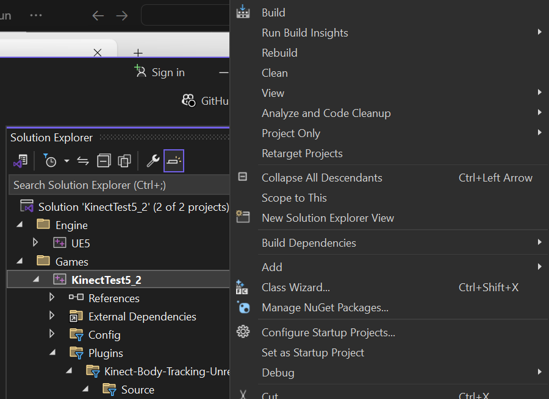

9. You should see build output and error (in Error List) at the bottom:

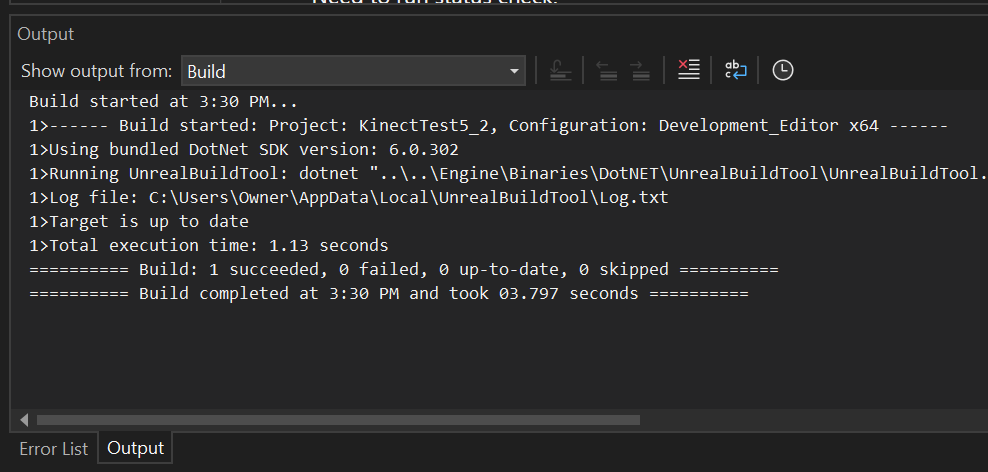

## View plugin content in content browser:

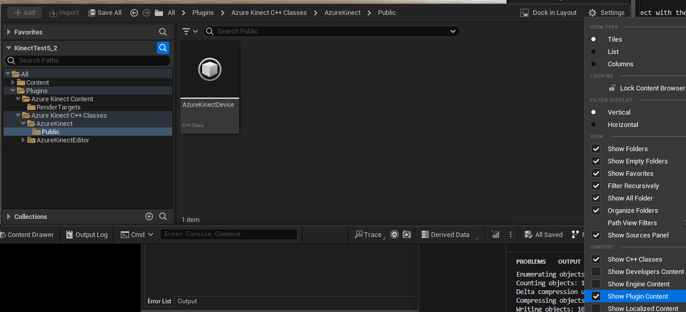

